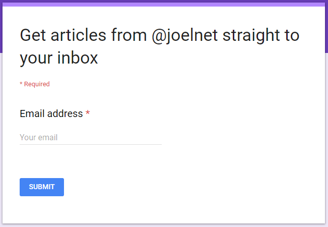

# I ❤ Ramda - Partial Application with Curry
[](https://creativecommons.org/licenses/by/4.0/)

# Introduction to I ❤ Ramda

The I ❤ Ramda series will differ slightly from others you may have seen. Instead of using the typical `foo`, `bar`, `baz` examples,
or articles demonstrating isolated functions, this series aims to showcase real world applications of Ramda.js.

This is the first article and will focus *Partial Application with Curry*.

# Partial Application with Bind

If you have used `bind`, you may already be familiar with the concept of Partial Application.

```javascript
const multiply = (a, b) => a * b

// partially apply 2 to multiply to create double
const double = multiply.bind(null, 2)

double(3) //=> 6
```

Using `bind` we were able to partially apply the value `2` to the argument `a` in the function `multiply` to  **create a completely new function** `double`.

The above solution (with `bind`) works just fine, even if we do have to call `bind` and also pass in the context (in this case it's `null`).

# Partial Application with Curry
The Ramda way of handling Partial Application would be to **Curry** the `multiply` function.

```javascript
import curry from 'ramda/src/curry'

const multiply = curry((a, b) => a * b)

// partially apply 2 to multiply to create double
const double = multiply(2)

double(3) //=> 6
```

Okay, so now the code is... _different_, but you're not excited, and I get that. But hang on because the **🧙 magic is just about to start**.

## Where bind falls short

Let's consider this example. Take a look at the last 2 lines...

```javascript
import fs from 'fs'

const output = (err, data) => {
  if (err) return console.log('ERROR:', err)
  console.log(data)
}

// How do I partially apply utf8?
fs.readFile('README.md', 'utf8', output)
fs.readFile('package.json', 'utf8', output)
```

All calls to `readFile` are going to be `utf8` and now that I think about it, they are all going to use the same `output` function too.

For this example **bind cannot be used** because `bind` will only apply arguments from left to right. A completely new function would have to be created.

```javascript
// Harrumph!
const outputUtf8File = file =>
  fs.readFile(file, 'utf8', output)
```

## Special Placeholder

Ramda has what they refer to as a **Special Placeholder** which is used to to partially apply arguments regardless of position.
To use this Special Placeholder, the function must first be curried.

```javascript
import curry from 'ramda/src/curry'
import __ from 'ramda/src/__' // Special Placeholder
import fs from 'fs'

// curry fs.readFile to add the magic
const readFile = curry(fs.readFile)
```

Now that `fs.readFile` has been curried into `readFile`, we can use Ramda's Special Placeholder (`__`) for the filename argument and partially apply, `utf8` and `output` to `readFile`.

```javascript
// partially apply utf8 and output.
const outputUtf8File = readFile(__, 'utf8', output)

outputUtf8File('README.md')
outputUtf8File('package.json')
```

😍 If you are not excited at this point, go see a doctor because you dead inside.

Let's finish this example up with some refactoring.

```javascript
// let's refactor this:
outputUtf8File('README.md')
outputUtf8File('package.json')

// into this:
const files = ['README.md', 'package.json']
files.map(outputUtf8File)
```

`readFile` can also be used like this because now we have more options!

```javascript
files.map(readFile(__, 'utf8', output))
```

## Homework

The best way to learn is to _do_ 😉. So for this excercise try to create two new functions `fetchGet` and `fetchPost` based off of the function `fetch`.

```javascript
import curry from 'ramda/src/curry'
import __ from 'ramda/src/__'
import fetch from 'node-fetch' // might need this in node.js land.

const url = '???' // pick a url to test

// fetch(url, { method: 'GET' })

const fetchGet = /* ??? */
const fetchPost = /* ??? */
```

If you need help, post questions in the comments section, I'll do my best to answer every question!

# What else can we do?

Here's a simplified snippet from a project I am working on. First I'll stub out the `tokenContract` so **you can also run this example**.

Again, don't read too much into this part of the code, it's just the setup. But notice to how the `curry` function is used below.

```javascript
import curry from 'ramda/src/curry'
import __ from 'ramda/src/__'

// example stub so you can run the code below
const tokenContract = {
  getTokenIndex: curry((account, tokenId) =>
    account === 1 && tokenId === 123
      ? Promise.resolve(1000)
      : Promise.reject()),
  getTokenAtIndex: curry((account, index) =>
    account === 1 && index === 1000
      ? Promise.resolve('success')
      : Promise.reject('fail')),
}
```

Now the meat 🍖

```javascript
const account = 1

// without partial application
tokenContract.getTokenIndex(account, 123) //=> then 1000
  .then(i => tokenContract.getTokenAtIndex(account, i)) //=> then "success"

// with partial application
tokenContract.getTokenIndex(account, 123) //=> then 1000
  .then(tokenContract.getTokenAtIndex(account)) //=> then "success"
```

Curry and Partial Application allowed us to trim `i =>` and `, i` off the ends of our function inside `then`. This is a pattern you will see _often_. The single argument supplied from the `then` function (in this case it's `i`) will become the final argument of the function to be called in `tokenContract.getTokenAtIndex`.

Further research: The process of omitting the `i` at the end is called point-free or tacit programming, the argument `i` being the "point".

And since I know the work I am doing will always be for `account`, I could apply the `account` value to both functions.

```javascript
const getToken = tokenContract.getTokenIndex(account)
const getTokenAtIndex = tokenContract.getTokenAtIndex(account)

getToken(123) //=> then 1000
  .then(getTokenAtIndex) //=> then "success"
```

# Extra credit

**Function composition will be covered in future articles**, but right now I'd like leave this as extra credit for you to research and tinker with:

```javascript
const account = 1

const getTokenIndex = tokenContract.getTokenIndex(account)
const getTokenAtIndex = tokenContract.getTokenAtIndex(account)

// Ramda's pipeP asynchronous function composer
const getToken = pipeP(
  getTokenIndex,
  getTokenAtIndex,
)

getToken(123) //=> then "success"
```

## Summary

This article briefly covered **Partial Application**, **Currying**, and even **Function Composition**. Head over to [Ramda](http://ramdajs.com/) to learn more. Ask questions in the comments, I will respond to every question!

If you found this interesting, I have more articles on [Medium](https://medium.com/@joelthoms/latest) and [dev.to](https://dev.to/joelnet).

Subscribe on [Twitter](https://twitter.com/joelnet), [Medium](https://medium.com/@joelthoms/latest), [dev.to](https://dev.to/joelnet) and [steemit](https://steemit.com/@joelnet) or [joel.net](http://joel.net) to be notified of future articles.

[](https://goo.gl/forms/tUTnRHsrSmgpf8XK2)

Cheers!
